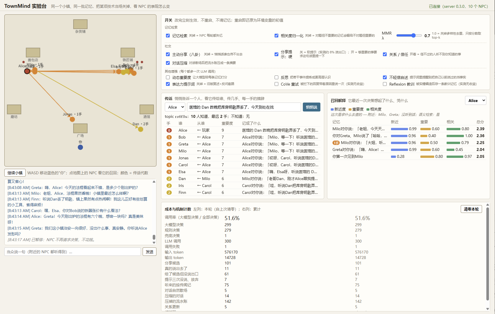
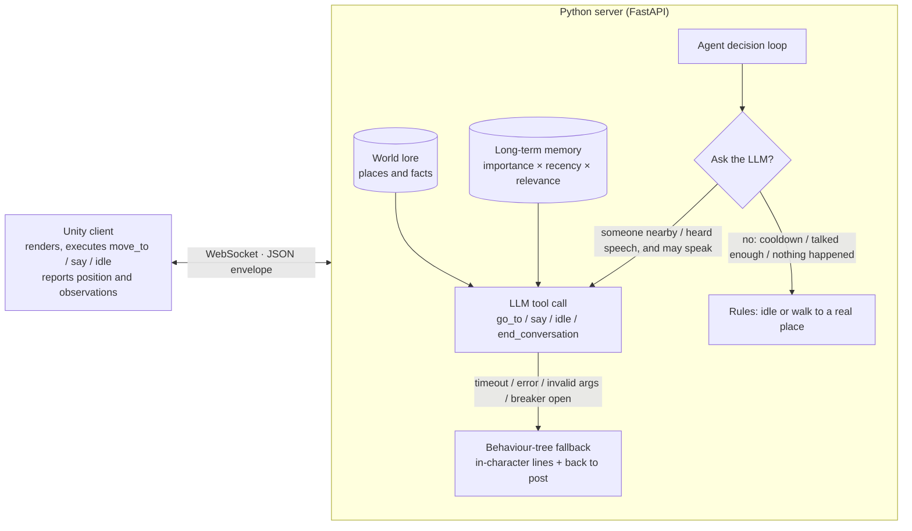

# TownMind

**English** · [中文](README.md) (the Chinese README is the full record: every experiment, every number, every rework; this page is the condensed version)

An LLM-driven AI-NPC system: **a Unity town (the body) + a Python agent server (the brain)**.
Ten NPCs with their own personalities, memories, relationships and workplaces act on their own, talk to each other and pass on what they hear; when the LLM is unavailable a behaviour tree takes over and the town keeps living.




The screenshot is `web_demo/` (served at `http://127.0.0.1:8000/` as soon as the server starts): the page drives all NPCs itself, no Unity needed. The four panels on the right are what the project is really about — **switches** (every mechanism toggled live, no restart, memories kept), **rumour tracing** (whisper something to one NPC, watch who it reaches, how many hops, how each hop re-phrases it), **recall explanation** (why an NPC remembered this memory and not that one) and **cost** (call rate and per-mechanism counters). The Unity client is in [docs/demo.png](docs/demo.png).

## 30 seconds: problem → approach → numbers

Every number comes from a reproducible script in `server/evals/` or a real run log; rows marked "real" used real models / real embeddings. Details, the rework behind each number and its limits are in the [Chinese README](README.md).

| Problem | Approach | Numbers (real) |
|---|---|---|
| LLM NPCs are expensive: every tick asks the model | Layered decisions: rules first (cooldown / caps), then an **event-driven gate** — only "someone spoke / someone arrived / there is a task" asks the model; long-time companions standing together is not an event | Call rate **43% → 20%** (80 → 38 calls/min, input tokens −52%); cost: utterances −39%, reply rate −2.6 pt; under load-test `max_in_flight` never exceeded the limit |
| Idle NPCs wander at random; the town has no "life" | Planning layer: one LLM-written daily schedule per NPC per game day (place enum + normalisation + template fallback) | Distinct places visited **5.3 → 2.7**, **91%** of the time where they should be; cost did not drop — paired workplaces exposed the gate's blind spot |
| NPCs can't recall the relevant memory | Three-factor scoring (recency + importance + relevance) with **cross-candidate normalisation** of relevance | Top-1 **0/5 → 5/5** with normalisation; semantic recall top-1 **33% → 100%** |
| Recall too slow, capacity stuck at 200 | Exact MMR candidate bound `2(1−λ)/λ` + one numpy matrix multiply, identical results | One recall **206 ms → 1.6 ms (129×)**; capacity **1000** (5 ms) |
| Memory fills with "you said 'hmm' to Bob" | Compress a conversation into one summary when it ends; facts / rumours / reflections not compressed | **142 lines → 14** summaries in 3 minutes; ~10× longer history in the same capacity |
| Fabricated events get passed on as facts | Treat "I heard" as a signal: store as hearsay (hop=1), prompt requires hedged wording, no endorsing, naming the source | 26 generated scenarios × 3, LLM judge: hedged wording **69% → 100%**, stated as first-hand 28% → 0%, source named 91% → 100% |
| How does a message travel, can it be traced | Memories carry a topic and a hop count; importance ×0.8 per hop; only counts as propagation if the sentence actually conveys it | A whisper reached **10 NPCs, 2 hops** in 3 minutes, every hop hedged; messages of importance 5/6/7/9 die after **0/1/2/3** hops |
| NPCs elaborate on their own earlier fabrications | Not a meta-rule: the guard classifier's verdict is injected as a concrete instruction | Continuing a fabrication **52% → 0%**, active correction **0% → 83%**; a prompt-only meta-rule went 54% → 56% (ineffective, recorded) |
| Regex can't catch event-type fabrications | Self-trained LoRA classifier (Qwen2.5-1.5B); a **111-item** clean bank showed v1 had learned "fantasy = fabricated", retrained v2 on the blind spots; a **94-item** bank with topics fixed in advance tests generalisation | 111: fabrication caught regex **2%**, v1 **51%** → v2 **92%**; 94 unseen types: v1 47% → v2 **74%** (blocked 56% → **91%**), false positives 2% unchanged |
| The guard may reject true statements | NLI "evidence veto": if the setting entails the sentence, overrule the guard | The one true sentence v2 rejected (entailment 1.00) **was rescued**: combined false positives 2% → **0%** |
| Front and back door use the same guard, so the back door can't catch what the front door missed | **Write-behind audit**: a background loop re-checks "things I said" with a stronger model, verdicts written back to memory; audit rules fixed in six lines | Same 94 items: guard-v2 catches 74%, auditor (gpt-5.5) **97%** with 2% false positives; mini + NLI veto 97% / 3% at 1/8 the price; real-run leak rate ≈3% (3 of 90) |
| Keyword judging may over- or under-count | LLM-as-judge: a stronger model labels by definition; both judgements side by side + Cohen's κ, disagreements listed for human review | Hallucination-recall κ=0.66, conclusion stands; hearsay κ=0.22, keywords had doubled the apparent gain — corrected |
| "Who is nearby" is O(n²) | Grid spatial index, verified against brute force | 1000 NPCs, one round **50–125 ms → 2–6 ms** |

**Also recorded as ineffective**: CoVe-style retry and Reflexion-style lesson memories showed no gain on real data and stay off by default; a prompt change pushing "vague deflection" toward "active correction" did nothing. Rule: no mechanism ships without real data behind it.

## Architecture



**Body and brain are separate**: Unity makes no decisions; it reports "where I am, what I heard" and executes the actions the server returns. The same brain can drive another engine, or run headless for evaluation without Unity at all.

## Features

| Capability | How |
|---|---|
| Tool calling | The LLM can only act through four tools (`go_to / say / idle / end_conversation`); arguments validated with pydantic; `go_to` places are an enum, so no walking to places that don't exist |
| NPC-to-NPC dialogue | Speech is an event (who, where, what); NPCs within 5 m "hear" it on their next decision; every line is generated, no canned dialogue |
| Cost control | Layered decisions: event-driven gate (speech / arrival / task / 90 s since last initiative); 6 s cooldown, max 3 lines per 30 s, `end_conversation` when done; zero-cost rules otherwise; 429 back-off using the server's suggested wait |
| Daily schedules | One LLM-written, persona-consistent schedule per NPC per game day (`planner.py`); idle NPCs follow it instead of wandering; game clock defaults to 600 s per day |
| Long-term memory | Score = recency decay + importance + relevance (semantic similarity when an embedder is configured); optional LLM importance scoring; reflection when accumulated importance crosses a threshold — the design from Stanford's *Generative Agents* (UIST 2023); top-5; capacity 1000 with numpy-vectorised retrieval (5 ms); conversations compressed into summaries when they end; atomic writes, memories survive restarts |
| Clarifying questions | When an instruction is ambiguous ("carry the sword to the square" — there are two swords) the LLM can call `ask_clarification`; the pending question is tracked explicitly across decisions |
| World lore | Places and facts are the source of truth; the prompt requires "if it's not in the lore, say you haven't heard of it"; the current place's lore is always included, town-wide facts are retrieved semantically together with memories |
| Social relations | Per-pair **affinity** and **trust** (liking ≠ trusting); bounded updates + decay to neutral (30-min half-life); below a trust threshold an NPC keeps what it knows to itself |
| Message propagation | NPCs proactively share things that are important, not yet told to this person, not about this person, and are events rather than quoted dialogue; counts as propagation only if the sentence actually conveys it (`conveys`); memories carry a topic and a hop count; ×0.8 importance per hop; second-hand memories are marked "rumour" in the prompt; "I heard…" is stored as hearsay |
| Hallucination defence | Four layers: local LoRA guard at the front door → NLI evidence veto → guard check of "things I said" with concrete correction injected → background write-behind audit by a stronger model (see the table above) |
| Experiment console | `web_demo/`: runtime switches (`POST /flags`), rumour tracing (`/rumor/{topic}`), recall explanation (`/recall/{npc}`), cost counters; live A/B on the same town |
| Robustness | 8 s timeout → behaviour-tree fallback; **circuit breaker** (3 consecutive failures → stop for 30 s, then probe); **concurrency cap** (4 in flight, queued not dropped) |
| Evaluation | Headless simulation + ablations + multi-seed aggregation + per-line audit + probe questions + LLM judge with κ + three human-reviewed scenario banks |
| Engineering | Docker / docker compose, GitHub Actions (tests + eval smoke + image health check), 366 unit tests |

## What the experiments taught (short version)

Each item below has a full section with tables in the [Chinese README](README.md).

- **The propagation chain was real, the content was fake.** The first live run of the console showed a whisper reaching 10 NPCs in 3 hops — but the hop-1 memory was "Alice said: good morning!" Alice had never mentioned the key. Fix: count propagation only when the sentence actually conveys the fact (`conveys`). Four such reworks, each found by drawing the chain, reading side-by-side logs, changing one thing and re-running on clean data.
- **Abstract meta-rules don't work; concrete, content-bound instructions do.** "Don't trust what you said before" moved nothing (54% → 56%). "The system checked: you said X, it's not in the setting, say you misremembered" moved continuing-a-fabrication from 52% to 0%.
- **A hand-written test set flatters you.** The guard scored 91% on 16 hand-written items and 51% on 111 generated ones: it had learned "fantasy = fabricated", not "not in the setting = fabricated". Retraining on plain fabrications paired with plain truths fixed the known blind spot (92%); a second bank with topics fixed before seeing results measures generalisation (74%).
- **A keyword judge can double an apparent gain.** Hearsay suppression looked like 47% → 80% by keywords and 80% → 100% by an LLM judge (κ = 0.22). Scaling to 26 generated scenarios gave 69% → 100%; eight scenarios whose claims already contained "maybe" inflated the baseline, so the effect is under-, not over-estimated.
- **One mechanism's data exposes another's flaw.** Schedules put NPCs where they belong (5.3 → 2.7 places) but did not cut cost, because paired workplaces kept companions side by side all day and the old gate asked the model whenever anyone was nearby. The gate judged presence, not events; the event-driven gate cut calls by 68% — by making NPCs talk less, which is stated as such.
- **A stronger model is not ground truth.** Three audit models on the same 90 real utterances caught 2/2/3 real fabrications and made 4/2/1 false calls; an NLI veto I had added on instinct turned out net negative for the strong auditor (97% → 94%) and net positive only for the cheap one — so it became a switch, off by default.
- **Known holes, not fixed**: an NPC can launder a fabrication by attributing it ("the mayor said…"), which the audit rules pass as hearsay; a fabrication already spread to other NPCs' memories is not retracted when its source is flagged.

## Quick start

Requires Python 3.12 and [uv](https://docs.astral.sh/uv/); Unity 6 is optional (visualisation only).

```bash
cd server
cp .env.example .env         # set OPENAI_API_KEY or ANTHROPIC_API_KEY, and TOWNMIND_LLM_PROVIDER
uv sync
uv run pytest -q             # unit tests
uv run uvicorn townmind.main:app --port 8000
```

It runs without a key: every NPC falls back to the behaviour tree.

Open `http://127.0.0.1:8000/` for the experiment console (no Unity needed). Initial values of the optional mechanisms live in `.env` (see `.env.example`); toggle them live from the page or `POST /flags`.

Docker:

```bash
docker compose up --build    # the key is read from the environment, never baked into the image
```

Unity: open `unity/TownMindClient` in Unity Hub, start the server first, then press Play.

Evaluations (in `server/`):

```bash
uv run python -m evals.run --llm offline --minutes 2                  # free, checks the pipeline
uv run python -m evals.run --llm real --minutes 5 --seeds 1,2,3       # real model, multi-seed
uv run python -m evals.run --llm real --minutes 5 --seeds 1,2,3 --configs full,plans,gate,plans_gate
uv run python -m evals.probes --llm real --repeats 5                  # probe questions
uv run python -m evals.memory_recall --embedder real                  # semantic recall accuracy
uv run python -m evals.memory_ablation --embedder real                # normalisation / MMR ablation
uv run python -m evals.hearsay --llm real --repeats 3 --judge         # hearsay suppression, with LLM judge + κ
uv run python -m evals.hallucination_recall --llm real --repeats 12 --judge
uv sync --group guard-model && uv run python -m evals.guard_fabrication --scenarios evals/scenarios/guard-holdout.json
uv run python -m evals.audit_recall [--model gpt-5.4-mini] [--nli]    # memory auditor recall / false positives
uv run python -m townmind.auditor data/memories [--run] [--nli]       # leak rate on real memories
uv run python -m evals.scale_test && uv run python -m evals.concurrency_test
```

API: `GET /health`, `GET /stats`, `GET /memories/{npc_id}`, `GET/POST /flags`, `GET /rumor/{topic}`, `GET /recall/{npc_id}`; the WebSocket also accepts a `whisper` message (tell one NPC one thing — the start of a rumour).

## Layout

```
server/townmind/   agent (decision loop), memory, social (affinity/trust), world, personas, fallback + bt (behaviour tree),
                   breaker (circuit breaker), guard_model + grounding (local guard and evidence veto), auditor (write-behind audit),
                   planner (schedules), llm/ (OpenAI / Anthropic)
server/evals/      sim (headless simulation), metrics, run (ablations), probes, memory_ablation, gossip_propagation, hearsay,
                   hallucination_recall, guard_fabrication, audit_recall, scale_test / concurrency_test, judge (LLM-as-judge), …
server/evals/scenarios/  human-reviewed scenario banks: guard.json (111), guard-holdout.json (94), hearsay.json (26)
server/web_demo/   experiment console (single HTML file, mounted at /)
server/tests/      unit tests (366)
guard/             LoRA training for the guard classifier: data generation, train, evaluate (own README)
unity/             Unity 6 client (rendering, action execution, position reporting)
```

## Known limitations

- Every real-data number is one 3–5 minute run or a few seeds, not a large-sample mean; scenario banks are 26–111 items; human review was done by one person.
- The guard generalises partially: 74% on unseen fabrication types; "rules" fabrications are often labelled out-of-character instead; mixed true/false sentences still slip. The NLI veto has a fixed blind spot (one Milo rule entailed at 0.99 in three separate evaluations).
- The audit treats anything attributed to someone else as hearsay, so attributed fabrications pass; nothing retracts a fabrication already spread to other NPCs' memories; there is a window of one audit interval before a new memory is checked.
- The event-driven gate saves cost by making NPCs talk less (utterances −39%); the town is noticeably quieter.
- Each LLM call carries ~1800 input tokens (lore, memories, persona); this is a larger cost item than call count and is untouched.
- MMR de-duplication was measured for speed, not for its effect on diversity; repetition is mainly handled by conversation compression.
- Memory files are JSON with 1536-dim vectors; an hour of play reaches ~12 MB per NPC. A real game would store vectors in binary or quantised form.
- No Unity-side test with hundreds of NPCs; the spatial index and concurrency limiter were load-tested headless only.
