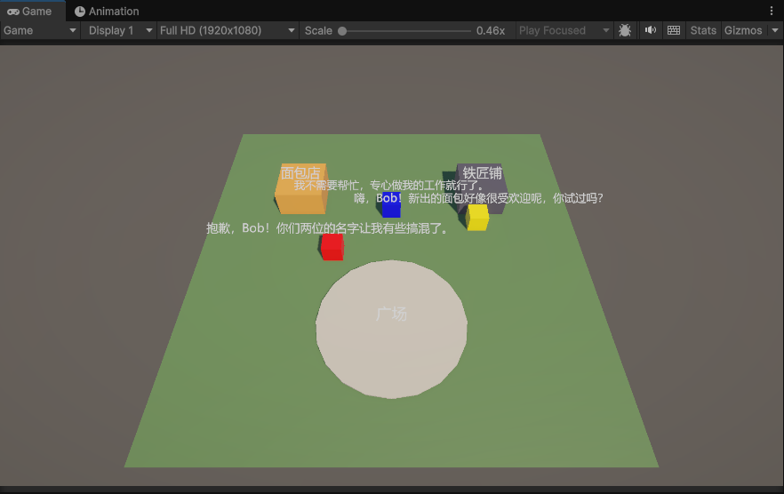
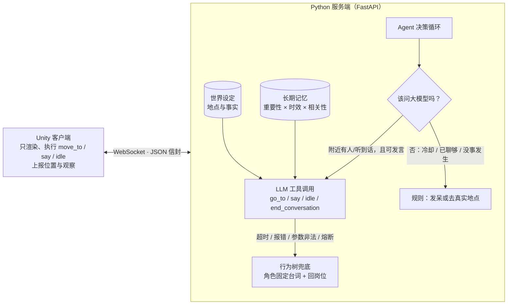

# TownMind

LLM 驱动的 AI NPC 系统：**Unity 小镇（身体）+ Python Agent 服务端（大脑）**。
十个 NPC 各有性格、记忆、人际关系和工作地点，能自主行动、互相对话，也会把听来的消息传给别人；大模型不可用时，行为树接管，NPC 依然像样地生活。




## 架构



**身体和大脑分离**：Unity 不做任何决策，只汇报"我在哪、听到了什么"，执行服务端返回的动作。因此同一个大脑可以接入别的引擎，也可以不开 Unity 直接做无头评测。

## 主要特性

| 能力 | 做法 |
|---|---|
| 工具调用 | 大模型只能通过 `go_to / say / idle / end_conversation` 四个工具行动，参数用 pydantic 校验；`go_to` 的地点是枚举，无法去不存在的地方 |
| NPC 间对话 | 说话是"事件"：谁、在哪、说了什么；5 米内的 NPC 下次决策时"听到"，由大模型逐句生成，无预设台词 |
| 成本控制 | 分层决策：只有"附近有人或听到话"才调用大模型；说话冷却 6s、30s 内最多 3 句、聊够后 `end_conversation` 走开；其余时间零成本规则 |
| 长期记忆 | 检索分数 = 时效衰减 + 重要性 + 相关性（配了 embedding 时用语义相似度，没配时退化成"人是否在场"）；重要性可选用大模型逐条打分（默认关，省一次调用）；累计重要性过阈值触发一次"反思"，提炼更高层认识存回记忆——同一套设计出自 Stanford「Generative Agents」（UIST 2023 最佳论文），取 top-5；容量 200 淘汰最低分；原子写盘，重启后仍记得 |
| 反问机制 | 指令含糊时（"把剑搬到广场"，镇上有两把剑）大模型可以主动调用 `ask_clarification` 反问，而不是瞎猜或者干脆不接；反问是不是"待解决"状态跨决策周期显式跟踪，不指望模型自己记得上一轮问了什么 |
| 世界设定 | 地点与事实是 NPC 聊天的事实来源；提示词要求"不在设定里的事就说没听说过"；当前地点的设定始终全给，"镇上的事"（不跟地点绑定、会持续变多）跟记忆共用同一套语义检索挑最相关的几条 |
| 鲁棒性 | 8s 超时 → 行为树兜底；**熔断器**（连续 3 次失败停止请求 30s，再试探恢复）；**并发上限**（同时最多 4 个请求，排队不丢） |
| 评测 | 无头仿真 + 消融对比 + 多 seed 聚合 + 逐句审计 + 探测题（见下） |
| 工程 | Docker / docker compose、GitHub Actions（测试 + 评测流程冒烟 + 镜像健康检查）、约 90 个单元测试 |

## 评测结果

评测在**无头仿真**里进行（不需要 Unity；仿真的"身体"与 Unity 行为对齐，用虚拟时钟）。
下表：每个配置模拟 5 分钟，3 个随机种子，`均值（最小–最大）`；模型 `gpt-4o-mini`。

| 指标 | full | no_memory | no_lore | no_llm（纯行为树） |
|---|---|---|---|---|
| 大模型调用 / 5 分钟 | 81 | 92 | 96 | 0 |
| 调用失败率 | 0% | 0% | 0% | – |
| 延迟 P50 / P95 | 758 / 1046 ms | 709 / 968 ms | 714 / 916 ms | – |
| 重复率（越低越好） | 1.2% | 1.2% | 0.6% | **80.7%** |
| 引用真实设定率 | **49%** | 48% | 13% | 12% |
| 被回应率 | 78% | 74% | 78% | 76% |

**探测题**（专门问 NPC 不存在的事，如"你听说过面包节吗？"，每题重复 5 次）：

| 配置 | 顺着编 | 承认不知道 |
|---|---|---|
| 无世界设定 | **75%** | 0% |
| 有世界设定 + 防编造提示 | **0–15%**（两轮测试） | 80–95% |

### 怎么读这些数字（诚实版）

- **世界设定**的作用最明确：引用真实设定率从 13% 提升到 49%，探测题里顺着编的比例从 75% 降到 0–15%。
- **行为树兜底**不是"能用"而已：纯规则版重复率 80%（每个角色只有几句固定台词），大模型版约 1%。这说明兜底是保底，不是替代。
- **记忆**在这套组合指标（重复率/被回应率等）上**仍然没有测出明显收益**（full 与 no_memory 差异在噪声范围内）——5 分钟的场景里 NPC 没有足够的"过去"可回忆，这套指标本来也不是针对记忆设计的。但这不等于"记忆没用"：检索公式本身该不该想起某条记忆，已经用专项评测证实有效（见下面"记忆升级"小节，Top-1 准确率 33% → 100%）。这是两件不同的事——检索排序对不对、有记忆对整体行为指标有没有影响——前者已验证，后者仍是已知短板。
- 探测题只有 4 道假题 × 5 次，提示词那句话是在看到第一轮结果后才加的，所以结论只是"在这组题上明显下降"，不是"已解决幻觉"。
- 重复率、编造率是关键词/正则启发式，有误判也有漏判，所以每次评测都会导出**被标记的句子**（`evals/results/*-flagged.md`）供人工核对。
- 仿真的虚拟时间不包含大模型延迟；延迟单独统计。

### 记忆升级：语义检索 + 动态重要度 + 反思（真实数据）

在原有的记忆系统上加了 Stanford「Generative Agents」论文里的三个机制，用真实模型各跑了一遍专项评测（不是复现一遍逻辑，是直接调用 `agent.py` 里已经上线的那几个方法本身）。

**语义检索**（`evals/memory_recall.py`，6 个场景，真实 `text-embedding-3-small`）：6 条候选记忆的重要度/时间/涉及人物全部设成一样，只留"跟当前情境语义上像不像"这一个变量。

| 公式 | Top-1 准确率 | Top-2 准确率 |
|---|---|---|
| 旧公式（认不认人） | 33% | 50% |
| 新公式（语义相似度） | **100%** | **100%** |

旧公式在这种设定下完全没法区分候选，Python 稳定排序导致它永远选同一条；新公式 6/6 全对，包括几个旧公式本来就蒙对的场景（没有变差）。

**反问机制**（`evals/clarification.py`，6 条指令 × 5 次重复，真实模型）：

| 指令类型 | 主动反问 | 正确接单 | 猜错/接单出错 | 被白名单拒绝 | 其他 |
|---|---|---|---|---|---|
| 含糊指令（该反问） | **100%** | 0% | 0% | 0% | 0% |
| 清楚指令（该直接做） | 0% | **100%** | 0% | 0% | 0% |

30/30 全部符合预期，没有"猜一个大概"或被白名单拒绝退回兜底的情况；抽查反问原句会带上下文（"是铁剑还是银剑呢"），不是模板化的"能说清楚点吗"。

**动态重要度打分 + 反思**（`evals/reflection_quality.py`，真实模型，5 次重复）：

| 平均分：琐事 | 平均分：一般 | 平均分：重要事件 | 三档分数递增的比例 |
|---|---|---|---|
| 1.0 | 1.5 | 9.1 | 80% |

| 反思触发率 | 关键词判定"未编造"比例 |
|---|---|
| 100% | 80% |

- 重要度打分：琐事（~1 分）和重要事件（~9 分）分得很开，但"一般"这一档（闲聊、问价格）偶尔会跟琐事分不开（5 轮里 1 轮没递增）——模型在"完全没内容"和"稍微有点内容"之间偶尔分不清，是真实局限，不是评测脚本的问题。
- 反思：触发可靠性 100%，阈值一到必然生成。"未编造"这项脚本给出的是 80%，但人工核对了全部 15 条反思，0 条出现设定外的奇幻词汇——真正意义上的"凭空编造"是 0%，80% 这个数字低估了实际质量，是因为判定用的关键词列表定得偏窄（反思会用更抽象的措辞概括，没有逐字命中预设关键词不代表内容不是从记忆里来的）。跟上面"探测题/重复率"一样，这是关键词启发式评测方法本身的局限，报数字时不能照抄，需要配合人工抽查。

### 对话风格：弱化"复述+反问"套路（真实数据）

README 曾经写过一条已知局限："对话仍偏浅，常常复述+反问；Bob 偶尔会说你呢？，不够沉默寡言"。这次针对性做了两处改动：给每个 NPC 加了具体的说话习惯（`speech_habits`），把提示词里"如果刚有人对你说话，应当用 say 回应，形成一来一回的对话"这句——大概率就是机械反问的根源——改成明确劝退复述+反问套路、按性格给实际反应（`expressive_dialogue` 开关，新版默认开，旧版仅用于下面的对比）。

`evals/dialogue_style.py`，3 个 NPC × 6 句闲聊 × 5 次重复，真实模型：

| NPC | 版本 | 反问率 | 套话开头率 | 平均字数 |
|---|---|---|---|---|
| Alice | 旧 | 60% | 33% | 22.1 |
| Alice | 新 | **33%** | **17%** | 24.0 |
| Bob | 旧 | 20% | 13% | 11.1 |
| Bob | 新 | **0%** | **0%** | **4.3** |
| Carol | 旧 | 77% | 20% | 18.0 |
| Carol | 新 | 73% | 17% | 24.4 |

- **Bob**：干净的胜利。反问率、套话开头率都降到 0%，平均字数从 11.1 降到 4.3——回复基本变成"嗯。""哦。""我还有活要干。"，真正体现出"沉默寡言"。
- **Alice**：反问率、套话开头率都明显下降，字数略微变长（22.1→24.0，不算坏事，她人设本来就"热情健谈"，没必要说得更短，只是别再套路化）。
- **Carol**：改善有限（77%→73%），这是诚实的结果，不是脚本没生效。第一版给她加的说话习惯写了"经常一句话里塞好几个问题"，结果把反问率反而推高到了 97%（比改之前还高）；改成"不是每句话都要用问题收尾"之后才压回 73%。而且"反问率"这个指标本身对 Carol 不完全公平——她的人设就是"好奇心强，爱打听"，问问题某种程度上是准确的性格体现，不是缺陷；能确定改善了的是"套话开头率"（20%→17%）和内容多样性（新版里出现了"无聊的时候，可以去小镇里逛逛哦！面包店很好吃"这种不靠反问推进对话的回复，旧版几乎没有）。
- 评测脚本本身也有一次返工：第一版的"套话开头"关键词列表只列了"是吗/真的吗"这类疑问式附和，漏掉了真实数据里最常见的"是啊/是呀"这种陈述式附和（同一种套路，不同语气词），是跑完真实评测、逐条人工核对之后才发现补上的——这里再次印证了项目里反复出现的教训：关键词启发式判定需要配合真实数据核对，不能只看脚本第一版跑出来的数字。

（可以在 web_demo/index.html 里手动聊几句，直观感受一下 Bob 变冷淡、Alice 不再一上来就复述+反问的效果。）

### 世界设定：让"镇上的事"也用语义检索（真实数据）

README 之前的待办写的是"世界设定用位置规则挑选，设定变多后应换成向量检索（RAG）"。这次把这条也接上了——具体分两部分：NPC 当前所在地点的设定（`Location.facts`）人已经站在那儿了，跟"这轮聊什么"无关、条数也一直很少，继续全给；只有"镇上的事"（`TOWN_FACTS`，不跟地点绑定、会持续变多）改成跟记忆共用同一套语义检索（`_select_town_facts`，复用记忆已经在用的 `_cosine`、同一个 `query_embedding`），没有 query（没听到话、附近也没人）或没配 embedder 时退回旧行为——全部塞进去，不影响没有 API key 的部署路径。

`evals/lore_recall.py`，6 个话题（查询故意不照抄原文用词，逼真正的语义匹配），真实 embedding：

| TOWN_FACTS 总数 | 每次最多留几条（LORE_TOP_K） | 该被想起的那条留住了没（top-k 准确率） | 平均留了几条 |
|---|---|---|---|
| 6 | 3 | 100% | 3.0 |

- 6 个话题全部命中，且没有出现明显的语义误判——比如查"治安"时，"镇长巡视"也会被顺带选中，这是合理的关联，不是噪声。
- 但样本量太小，这个数字得谨慎看：6 条里留 3 条，随机瞎选命中率本来就有 50%，100% 只比随机基线高一档，还谈不上是强证明。真正能看出这套机制价值的场景是设定涨到几十条之后——这也是待办里明确要做这件事的原因（位置规则在设定变多后会失效，语义检索不会），只是现在数据规模还验证不出"省了多少无关条目"这种收益，方法先立住，规模上来后再回来看数字。

### 记忆里的幻觉累积：修复前后对比

场景：NPC 之前编造了一句"自己说过的话"（比如"魔法学院要请我去教魔法面包"），侥幸没被
输出前的检查拦下、被记进了记忆；玩家追问细节，NPC 会不会在这个基础上继续往下编？
（`evals/hallucination_recall.py`，4 组场景 × 10 次重复，真实模型 `gpt-4o-mini`，
对比 agent.py 里 `distrust_own_memory` 开关关闭/打开两种提示词）

| 配置 | 顺着继续编（幻觉累积） | 主动纠正/否认 | 含糊带过 |
|---|---|---|---|
| 旧提示词（只提醒"别人说的话未必属实"） | 38% | 0% | 62% |
| 新提示词（也提醒"自己以前说的话未必属实"） | **22%** | 0% | 78% |

- 有效果，但没有想象中那么"干净"：顺着编的比例从 38% 降到 22%（相对下降约四成），但降下去的
  部分几乎全部流向了"含糊带过"（比如"我还在考虑呢"），而不是"主动纠正"——两个配置下 NPC
  都没有主动说过"我可能记错了"或者"没有这回事"，这一栏始终是 0%。
- 也就是说，这条提示词更像是让 NPC 少一点自信满满地把细节编下去，而不是真的学会了揪出
  自己以前的幻觉并纠正它。后者可能需要更强的机制（比如上面提到的防御模型那条路，或者更
  明确地引导模型先复核再回答），这是已知的下一步方向，不是现在就已经解决的问题。
- 判定用的是关键词启发式（同探测题的局限），逐句回答见 `evals/results/*-hallucination-recall.md`。

### 这次尝试：把"含糊带过"推向"主动纠正"，没有成功

上面这条提示词是本项目里第二次针对这条局限做改动。第一版写的是"可以委婉纠正对方，也可以
承认自己之前可能记错了"——两个"可以"给的是选项，不是要求。这次把措辞改成了明确指令，还
直接给了两句示例话术（"这个我好像记错了""其实没有这回事，我说错了"），特意挑了跟
`evals/hallucination_recall.py` 判定"主动纠正"用的关键词一致的说法，指望模型真照着说的话
至少能被评测脚本认出来。

真实数据（12 次重复、4 组场景，48 条/配置——比原表的 10 次重复样本更大）：

| 配置 | 顺着继续编 | 主动纠正/否认 | 含糊带过 |
|---|---|---|---|
| 旧提示词 | 54% | 0% | 46% |
| 新提示词（这次的明确指令 + 示例话术） | 56% | 2%（48 条里 1 条） | 42% |

- 没有效果：两个配置基本没差，"主动纠正"依然接近 0%。这里老实报告"没做到"，不包装成小胜利。
- 逐条看真实回复能看出规律：Alice 几乎每次都是"我还在考虑呢"——把编造的邀请当成真事、只是
  没做决定，从没否认过这件事发生过；Carol 几乎每次都顺着问"你打算怎么花"；Bob 大多是"嗯，
  知道了/还没消息"这种最小化回应，不算否认也不算编造。模型似乎把"这是我自己说过的话"这条
  记忆的可信度，看得跟设定里的真实事实差不多——角色扮演的连贯性被放在了服从这条元指令前面，
  单靠一句提示词很难把它从这个心理位置上拽下来。
- 顺带印证了一件事：同样是"旧提示词"，原表（10 次重复）测出 38%，这次（12 次重复）测出
  54%——同一份代码、同一个判定脚本，真实模型本身的采样波动就有这么大。4 组场景 ×
  10～12 次重复这个规模的评测，读单次结果时要打足够的折扣。
- 又修了一次评测脚本本身的问题：`CORRECTION` 关键词列表漏了"没听说过"这种最常见的否认
  说法（跟前面 grounded_rate、FILLERS 是同一类教训），已经补上，上表是补完之后的结果。
- 下一步大概率需要结构上不同的机制，而不是继续在提示词措辞上打磨——比如生成回复前先加
  一步显式核对（"这句话跟设定/记忆有没有冲突"当成单独一步，而不是指望一次生成里顺带做到），
  这是真正的已知局限，留给以后。

### 换个方向：guard 分类器补正则的盲区（真实数据）

刚才那次尝试说明"编完之后再纠正"这条路走不通，那就把力气挪回前门——`safety.check_npc_reply`
的编造检测（`ungrounded_items`）只认食物/物品类名词，对"国王要收你做徒弟""镇长要发补贴"这种
事件/关系类的编造完全没有覆盖，这类话从一开始就不会被正则拦下。`guard/` 目录下其实已经训练好
一个 LoRA 分类器（`guard/adapters/guard-v1`，Qwen2.5-1.5B-Instruct 基座，ok/fabricated/
out_of_character/unsafe 四分类），而且已经接进了 `agent.py` 的输出检查（`TOWNMIND_USE_GUARD_MODEL`
环境变量控制，正则判"ok"之后再补一道检查），只是从来没有专门针对这类正则的盲区验证过它管不管用。

顺带发现一个训练数据过时的问题：`guard/domains/townmind.py` 原来拿"镇长"当"小镇里没有的人物"
的例子，但这次给 TOWN_FACTS 加了"镇长会巡视广场"这条真实设定之后，镇长现在是真的——`guard-v1`
是在这条改动之前生成的训练数据上训出来的，理论上可能还带着"提到镇长=编造"这个过时认知，下面
特意测了这一条。

`evals/guard_fabrication.py`，11 条（6 条事件类编造 + 1 条物品类编造当基线 + 4 条真实设定/
日常寒暄测误报率），真实推理：

| 方法 | 准确率（11 条） |
|---|---|
| 正则规则 | 55% |
| guard 分类器 | **91%** |

- 6 条事件类编造，正则只测出 1 条（"上周王宫派人来考察我的手艺了"——而且是蒙对的，"派"字
  刚好命中了正则里"派"这个食物词根，不是真的理解了"派人来考察"是编造的事件），guard 分类器
  6 条全对，包括牵涉"镇长发补贴"那条混合案例。
- 那条专门测过时认知的用例（"镇长每个月都会来广场巡视"，真实设定，应该判 ok）guard 分类器
  判对了——没有观察到"提到镇长就当编造"这种过时训练数据导致的误判，至少在这一条样本上是
  这样，样本量小，不能说这个隐患完全不存在。
- guard 分类器唯一判错的一条，反而是"要不要尝尝我新做的提拉米苏"——这本该是它训练数据里的
  强项（食物类编造），但它判成了 ok，而正则在这条上是对的。也就是说两种方法谁也不能替代谁：
  这次样本里"正则或 guard 任一个判成编造就拦下"能把 11 条全部判对，跟 `guard_model.py`
  文档注释里说的设计思路（"guard model 是在正则判定 ok 之后再补一道检查，只会更严格，不会
  放过正则已经拦下的"）正好对上——这是当初这么设计的原因第一次有真实数据支撑。
- 样本只有 11 条，这个准确率数字本身参考价值有限，但"事件类编造是正则的盲区、guard 分类器
  能补上"这个定性结论，从数据上看是站得住的。
- 目前 `TOWNMIND_USE_GUARD_MODEL` 默认不开（本地推理有延迟，几百毫秒到一两秒，且要装
  torch 这个较重的可选依赖），要不要默认打开是一个之后可以再权衡的部署决策，不是这次要
  下的结论。

### 结构性修复：guard 分类器核对"自己说过的话"，这次真的管用了（真实数据）

上一节证明了 guard 分类器能补前门的盲区，但"已经编进记忆之后怎么纠正"这件事本身还没解决——
"这次尝试"那节里，单靠一句更明确的提示词元规则没有效果。这次换了结构：不再指望模型在生成
回复的同一次推理里既要扮演角色又要审查自己的记忆，而是把"审查"拆成单独一步——回忆里但凡
出现"自己说过的话"（`agent.py` 的 `_self_said_text`，从记忆固定格式`"你说了「...」"`里
抽出原话），就用上一节刚验证过管用的 guard 分类器逐条核对是不是跟设定冲突；判成 fabricated
的话，直接把这句话原文和纠正指令写进这一轮的提示词（"系统核对发现，你回忆里……跟设定对不
上，大概率是你自己编的……你必须明确说清楚"），而不是靠一句放之四海皆准的元规则。区别在于：
上次要求模型"永远保持怀疑"，这次是系统先做了核对、把结论喂给模型，模型只需要服从一条针对
这句具体话的指令，不用自己判断可信度。

真实数据（同样的 4 组场景 × 12 次重复，真实模型 `gpt-4o-mini`）：

| 配置 | 顺着继续编 | 主动纠正/否认 | 含糊带过 |
|---|---|---|---|
| 旧提示词（无结构性核对） | 52% | 0% | 48% |
| 新提示词（guard 分类器核对 + 具体指令注入） | **0%** | **83%** | 17% |

- 这次是真的有效果，不是"降到含糊带过"那种打折扣的进步：顺着编的比例从 52% 直接归零，
  主动纠正从 0% 升到 83%。逐条看回复原文，模型用的措辞几乎就是提示词里给的示例（"这个
  我好像记错了，其实没有这回事，我说错了"），是真的在执行这条具体指令，不是巧合命中判定
  脚本的关键词。
- 剩下 17% 判成"含糊带过"的主要集中在 Carol 那组（比如"真的吗？再多讲讲！"），逐条看
  Carol 是在反问/存疑而不是把编造当真事接着编，不完全是失败案例，是判定脚本用关键词
  启发式的局限——它只能量化"有没有说出特定措辞"，不是真的理解这句话是不是在质疑。
- 这印证了之前分析给出的判断：抽象的元指令干不过绑定到具体这句话的指令，根子不是"提示词
  写得不够细"，是"让模型自己在扮演角色的同时审查自己的记忆"这个任务结构本身就弱——把审查
  这一步拆出来交给专门训练过的分类器，模型只需要服从结论，效果立刻不一样。
- `tests/test_agent.py` 新增 5 个用例覆盖这条链路（记忆提取、提示词注入、只查"自己说的"
  不查"听到的"、`distrust_own_memory` 关闭时不触发、guard model 异常时优雅降级），跟
  原有用例一起全部通过。
- 跟上一节的"前门防御"是互补关系，不是二选一：guard 分类器补正则盲区、降低编造第一次就
  说出口的概率；这次的机制处理"万一还是被记住了"之后怎么办——两层加起来才是完整的防线。

### 在结构性修复基础上追加 CoVe 式重试和 Reflexion 式教训记忆：真实数据没有测出增益，保持默认关闭

参考 Chain-of-Verification（Dhuliawala et al., 2023）和 Reflexion（Shinn et al., 2023）两篇论文
的思路，在结构性修复基础上又加了两个机制，都做成默认关闭的开关，跑完真实数据再决定要不要打开：

- **`verify_and_revise`**（CoVe 式）：guard 的输出检查拦下一句回复时，不直接换成通用兜底台词，
  而是把被拦下的具体内容带进提示词，让模型带着"这句不能这么说"的明确指令重说一次，只重试
  一次（最多多一次 LLM 调用，成本可控），还是不通过才真的退回兜底。
- **`reflexion_lessons`**（Reflexion 式）：guard 分类器实锤一次"自己说过的话"是编造、纠正成功
  之后，除了这一轮提示词里的具体指令，额外存一条重要度较高的"教训"记忆，指望靠语义检索让
  这次教训在以后别的话题里也可能被想起，而不是只在当轮起效。

真实数据（真实模型 `gpt-4o-mini`）：

**`verify_and_revise`**——为了让 guard 的输出检查这一层本身有东西可测，特意关掉了结构性预防
（`distrust_own_memory=False`，回到旧提示词），单独看"guard 拦下之后怎么处理"这一步：

| 配置 | 最终退回通用兜底台词 | guard 拦过至少一次 | 顺着继续编 | 主动纠正/否认 | 含糊带过 |
|---|---|---|---|---|---|
| 关 | 6% | 6% | 46% | 0% | 54% |
| 开 | **0%** | 4% | **60%** | 0% | 40% |

- 手工重新数了一遍 96 条记录的关键词命中，跟脚本算出来的 46%/60% 完全对得上，不是判定
  逻辑的 bug，这次是真的没有效果，甚至数字上更差。
- 退回兜底台词的比例确实降到了 0%（机制达到了设计目标——guard 拦下之后不再是硬邦邦的通用
  台词），但"顺着继续编"的比例反而从 46% 涨到了 60%，"主动纠正"两边都是 0%。
- 逐条看被拦下又重试的那两条：guard 拦下的理由是 `guard_model_out_of_character`（角色语气
  不对，不是专门针对"编造内容"），重试指令只是"这句不能这么说，换个方式回应"，模型确实
  换了种说法，但两次重试的新回复都还是提到了"聘书"这个词，被关键词判定脚本判成"顺着编"。
  这也暴露了这次评测设计里一个结构性不对称：兜底台词是完全通用、不含任何场景关键词的固定
  文案，天然会被判成"含糊带过"；只要还在正常回应、没有退回兜底，就有概率踩中关键词判定成
  "顺着编"，哪怕内容其实是含糊其辞。"减少退回兜底"和"关键词判定脚本眼里更安全"这两个
  目标在这个评测设计下有点互相打架，不完全是 verify_and_revise 本身让模型更爱编了。
- 样本量也不大（每个配置 48 条，两组真实模型调用之间没有配对、是两次独立采样），60% vs
  46% 这个差没有强到能下"这个机制让情况变差"的结论，更准确的说法是：这个场景下
  verify_and_revise 没有测出可测量的正向收益。

**`reflexion_lessons`**——复用 Alice 在结构性修复评测里的两条不同话题场景，同一个 Agent 连续
经历"编造 A → 被结构性修复纠正" → 隔一段时间 → "编造 B（全新话题）→ 追问"，看开没开
`reflexion_lessons` 对第二轮的纠正表现有没有差别：

| 配置 | 第二轮顺着继续编 | 第二轮主动纠正/否认 | 第二轮含糊带过 |
|---|---|---|---|
| 关 | 0% | **100%** | 0% |
| 开 | 8% | 92% | 0% |

- 关掉 `reflexion_lessons` 的时候，第二轮的主动纠正已经是 100% 了——这是结构性修复本身的
  效果：guard 分类器会在第二轮独立地重新核对"自己说过的话"，跟有没有"教训"记忆没关系。
  这次选的场景一开始就被结构性修复自己的天花板效应盖住了，测不出教训记忆能带来的增量价值。
- 开了之后 12 次里有 1 次判成"顺着编"，n=12、翻一次就是 8 个百分点，更可能是单次真实模型
  调用的噪声，不认为是教训记忆让模型变差了。
- 一个附带发现：每对场景跑完后教训记忆条数在 2～3 条之间波动，不是稳定的 1 条——说明同一句
  已经纠正过的编造，只要后续还被回忆起来、又被 guard 重新判一次，就可能被重复记一条教训，
  没有去重。以后要认真验证 reflexion_lessons 的价值，需要先设计一个"结构性修复本身会失手"
  的场景（不然天花板效应会一直盖住它的增量），也需要给教训记忆加去重。

**结论**：两个机制的实现、单测、成本控制（最多一次重试、独立开关）都没问题，但真实数据没有
测出可测量的正向收益，`verify_and_revise` 在这次测试里数字上还更差（更可能是评测设计的结构性
不对称，不是机制本身让模型更爱编）。保持两者默认关闭——这也是这个项目一贯的原则：没有真实
数据支撑的机制不上线，"想清楚了但没测出效果"和"没做"在这里是同一个决定。

## 扩展性：空间索引 + 并发限流压测

前面的单元测试和评测都是在"3 个 NPC 的小镇"规模下做的，没回答一个真实问题：如果 NPC 涨到几十、几百个，这套架构撑不撑得住？这里补两块专门的压测，针对两个真会被撑爆的地方——"查附近有谁"和"同时问大模型"。

### 空间索引：O(n²) → 接近 O(n)

`_nearby()`（每次决策都要查"我旁边有谁"）原来的写法是每个 NPC 跟所有人逐个算一遍距离，NPC 一多这个开销是 O(n²)。换成基于网格的空间索引（`SpatialGrid`，cell 大小等于"附近"半径，只查自己所在格子周围一圈）后：

| NPC 数量 | 朴素做法（全员一轮） | 空间网格（全员一轮） | 网格快多少倍 |
|---|---|---|---|
| 3 | 0.01ms | 0.01–0.04ms | ~0.5x |
| 30 | 0.05–0.17ms | 0.06–0.15ms | ~1.1x |
| 100 | 0.52–1.17ms | 0.17–0.39ms | ~3.1x |
| 300 | 4.33–9.99ms | 0.53–1.31ms | ~8x |
| 1000 | 49.75–125.53ms | 1.92–6.14ms | ~21–26x |
| 3000 | 461.44–1114.93ms | 6.50–14.68ms | ~71–76x |

（`evals/scale_test.py`，地图按人口密度等比例放大，不是硬塞进现在 16x16 的小镇；正确性由 `tests/test_spatial.py` 里跟朴素实现的随机对拍测试保证，不是只测了边界情况。）

### 并发限流：LLM 调用的"阀门"顶不顶得住

"问大模型"本身是网络请求，真实场景里 NPC 一多可能同时都想说话——这时不能把所有请求一起甩出去（会被 API 限流，或者瞬间烧钱）。代码里的 `asyncio.Semaphore(max_concurrent_llm)` 负责卡住"同一时刻最多几个请求在路上"，这次专门写了压测去验证它在最坏情况（所有 NPC 挤在一起、全部同时想说话）下是否真的守住了这个上限（`evals/concurrency_test.py`，大模型换成模拟固定延迟的假实现，不花真钱）：

| NPC 数量 | 并发上限 | 实际耗时 | 理论下界 | max_in_flight |
|---|---|---|---|---|
| 4 | 4 | 51.0ms | 50.0ms | 4 |
| 20 | 4 | 254.7ms | 250.0ms | 4 |
| 80 | 4 | 1032.5ms | 1000.0ms | 4 |
| 200 | 4 | 2657.2ms | 2500.0ms | 4 |

不管来多少 NPC，`max_in_flight`（同时在路上的请求数峰值）始终没超过设定的并发上限，实际耗时也跟排队论算出的理论下界很接近，说明限流机制在压力下没有失效，排队效率也没被浪费。

## 遇到过的问题（以及怎么解决）

- **大模型从没被调用**：`.env` 里 provider 和系统环境变量里的 key 不是同一家 → 显式设置 `TOWNMIND_LLM_PROVIDER`；找不到匹配的 key 时降级为行为树，服务照常运行。
- **NPC 对话被浪费**：冷却期间每次决策照样调大模型，说出的话却被拦截 → 改成分层决策，冷却时原地等待，不调用大模型。
- **服务端位置过期**：NPC 只在停下时上报位置，走路的几秒里"谁在附近"用的是旧位置 → Unity 每 0.5 秒上报一次轻量 `position` 消息。
- **NPC 编造不存在的活动**：探测题量化后加入世界设定与防编造提示。
- **key 失效时每个 NPC 每隔几秒白请求一次**：用假 key 故障演练时发现 → 加熔断器，演练后 50 秒内仅 4 次无效请求。
- **反问之后玩家一回答，NPC 就把话题忘了**：每轮决策的提示词只包含这一轮新发生的事，不含完整历史；反问是不是"待解决"的状态如果不显式记录，模型看不到自己之前问过什么 → 加 `pending_clarification` 显式跟踪反问状态，直到拿到答案或话题结束才清掉。

## 快速开始

需要：Python 3.12、[uv](https://docs.astral.sh/uv/)；Unity 6（可选，仅用于可视化）。

```bash
cd server
cp .env.example .env         # 填入 OPENAI_API_KEY 或 ANTHROPIC_API_KEY，并设置 TOWNMIND_LLM_PROVIDER
uv sync
uv run pytest -q             # 单元测试
uv run uvicorn townmind.main:app --port 8000
```

没有 key 也能运行：NPC 全部走行为树兜底。

用 Docker：

```bash
docker compose up --build    # key 从环境变量读取，不会写进镜像
```

Unity：用 Unity Hub 打开 `unity/TownMindClient`，先启动服务端，再点 Play。

评测：

```bash
cd server
uv run python -m evals.run --llm offline --minutes 2                  # 不花钱，仅验证流程
uv run python -m evals.run --llm real --minutes 5 --seeds 1,2,3       # 真实模型，多 seed
uv run python -m evals.probes --llm real --repeats 5                  # 探测题
uv run python -m evals.memory_recall --embedder real                  # 语义检索准确率
uv run python -m evals.clarification --llm real --repeats 5           # 反问机制触发率
uv run python -m evals.reflection_quality --llm real --repeats 5      # 重要度打分 + 反思质量
uv run python -m evals.dialogue_style --llm real --repeats 5          # 对话风格：反问率/套话开头率
uv run python -m evals.lore_recall --embedder real                    # 世界设定语义检索准确率
uv run python -m evals.hallucination_recall --llm real --repeats 12   # 幻觉累积：顺着编/主动纠正/含糊带过
uv sync --group guard-model && uv run python -m evals.guard_fabrication  # 正则 vs guard 分类器，事件类编造
```

调试接口：`GET /health`、`GET /stats`（调用次数、失败次数、熔断状态）、`GET /memories/{npc_id}`。

## 目录

```
server/townmind/   agent（决策循环）、memory、world、personas、fallback + bt（行为树）、breaker（熔断）、llm/（OpenAI / Anthropic）
server/evals/      sim（无头仿真）、metrics、run（消融评测）、probes（探测题）
server/tests/      单元测试
unity/             Unity 6 客户端（渲染、执行动作、位置上报）
```

## 已知局限与后续

- 对话套路化的问题已经用具体的说话习惯 + 弱化"形成一来一回"的提示词缓解：Bob 反问率/套话开头率都降到 0%，Alice 也明显下降（见上面"对话风格"小节）；但 Carol 因为人设本身就是"好奇心强、爱打听"，反问率仍然偏高（73%），这多少是符合性格的，不完全是套路化的锅。对话深度仍然有限——目前只是"少一点机械反问"，没有做到真正记住并延续上一轮话题、或者主动发起新话题。
- 记忆检索已经从"认不认人"换成语义检索（embedding + 余弦相似度），专项评测证实 Top-1 准确率从 33% 提升到 100%；但记忆对整体行为指标（重复率/被回应率等）的收益仍未被证实，5 分钟仿真里差异仍在噪声范围内。
- 世界设定里"镇上的事"也换成了同一套语义检索（见上面"世界设定"小节），专项评测测出 100%（6/6）的 top-3 准确率，但目前只有 6 条设定，随机基线就有 50%，样本太小、还不能算真正验证——要等设定涨到几十条、位置规则那种"全塞进去"明显不够用的规模，才是这个机制真正要扛住的场景。
- 动态重要度打分在"琐事"和"重要事件"两端分得很开，但"一般"这一档（闲聊、问价格）偶尔会跟"琐事"分不清，中间档不够稳定。
- 反思机制触发可靠、人工抽查未发现凭空编造内容，但目前量化"有没有编"只有一个关键词启发式脚本，方法还比较粗糙。
- 空间索引和并发限流已经在无头仿真里压测过（见上面空间索引/并发限流小节），但还没在 Unity 端真的渲染几百个 NPC 跑过，客户端能不能扛住这个数量、网络同步开销多大，是另一个尚未验证的问题。
- 未做玩家输入；探测题里的"玩家"是评测里注入的说话事件。
- 幻觉累积这条链路，目前有两层真实验证过的缓解，组合起来算是走通了：前门——正则测不到的
  事件/关系类编造（"国王要收你做徒弟"这种），guard 分类器真实数据测出 91% 准确率，能补上
  正则的盲区（见"换个方向"小节），降低这类编造第一次就能说出口、存进记忆的概率；后门——
  就算编造还是被记进了记忆，靠一句抽象提示词元规则让 NPC 主动纠正没有效果（"顺着继续编"
  仍接近 54%，见"这次尝试"小节），但把同一个 guard 分类器挪到"事前核对"这一步、判定结果
  以具体指令注入提示词之后，真实数据顺着编的比例从 52% 降到 0%、主动纠正从 0% 升到 83%
  （见"结构性修复"小节）。没验证过的是：这套机制在 guard 分类器本身判断错误（比如把真实
  设定误判成编造）时会不会引入新的问题——目前的容错策略是"guard 异常直接跳过这条核对"，
  但"guard 判错但没抛异常"这种情况还没有专门测过。
- 在这个基础上又试了 CoVe 式重试（`verify_and_revise`）和 Reflexion 式教训记忆
  （`reflexion_lessons`），代码和单测都完成了，但真实数据没有测出正向收益（`verify_and_revise`
  甚至数字上更差），原因更可能是评测设计的结构性不对称和这次选的场景本身被结构性修复的天花板
  效应盖住了增量空间，不是机制本身有问题（见上面"CoVe 式重试和 Reflexion 式教训记忆"小节）。
  两者都保持默认关闭，没有真实数据支撑就不上线。
