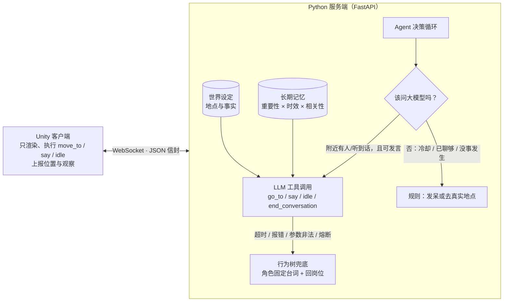

# TownMind

LLM 驱动的 AI NPC 系统：**Unity 小镇（身体）+ Python Agent 服务端（大脑）**。
三个 NPC 各有性格、记忆和工作地点，能自主行动、互相对话；大模型不可用时，行为树接管，NPC 依然像样地生活。


## 架构



**身体和大脑分离**：Unity 不做任何决策，只汇报"我在哪、听到了什么"，执行服务端返回的动作。因此同一个大脑可以接入别的引擎，也可以不开 Unity 直接做无头评测。

## 主要特性

| 能力 | 做法 |
|---|---|
| 工具调用 | 大模型只能通过 `go_to / say / idle / end_conversation` 四个工具行动，参数用 pydantic 校验；`go_to` 的地点是枚举，无法去不存在的地方 |
| NPC 间对话 | 说话是"事件"：谁、在哪、说了什么；5 米内的 NPC 下次决策时"听到"，由大模型逐句生成，无预设台词 |
| 成本控制 | 分层决策：只有"附近有人或听到话"才调用大模型；说话冷却 6s、30s 内最多 3 句、聊够后 `end_conversation` 走开；其余时间零成本规则 |
| 长期记忆 | 每条记忆有重要性；检索分数 = 时效衰减 + 重要性 + 与眼前人物的相关性，取 top-5；容量 200 淘汰最低分；原子写盘，重启后仍记得 |
| 世界设定 | 地点与事实是 NPC 聊天的事实来源；提示词要求"不在设定里的事就说没听说过" |
| 鲁棒性 | 8s 超时 → 行为树兜底；**熔断器**（连续 3 次失败停止请求 30s，再试探恢复）；**并发上限**（同时最多 4 个请求，排队不丢） |
| 评测 | 无头仿真 + 消融对比 + 多 seed 聚合 + 逐句审计 + 探测题（见下） |
| 工程 | Docker / docker compose、GitHub Actions（测试 + 评测流程冒烟 + 镜像健康检查）、约 90 个单元测试 |

## 评测结果

评测在**无头仿真**里进行（不需要 Unity；仿真的"身体"与 Unity 行为对齐，用虚拟时钟）。
下表：每个配置模拟 5 分钟，3 个随机种子，`均值（最小–最大）`；模型 `gpt-4o-mini`。

| 指标 | full | no_memory | no_lore | no_llm（纯行为树） |
|---|---|---|---|---|
| 大模型调用 / 5 分钟 | 81 | 92 | 96 | 0 |
| 调用失败率 | 0% | 0% | 0% | – |
| 延迟 P50 / P95 | 758 / 1046 ms | 709 / 968 ms | 714 / 916 ms | – |
| 重复率（越低越好） | 1.2% | 1.2% | 0.6% | **80.7%** |
| 引用真实设定率 | **49%** | 48% | 13% | 12% |
| 被回应率 | 78% | 74% | 78% | 76% |

**探测题**（专门问 NPC 不存在的事，如"你听说过面包节吗？"，每题重复 5 次）：

| 配置 | 顺着编 | 承认不知道 |
|---|---|---|
| 无世界设定 | **75%** | 0% |
| 有世界设定 + 防编造提示 | **0–15%**（两轮测试） | 80–95% |

### 怎么读这些数字（诚实版）

- **世界设定**的作用最明确：引用真实设定率从 13% 提升到 49%，探测题里顺着编的比例从 75% 降到 0–15%。
- **行为树兜底**不是"能用"而已：纯规则版重复率 80%（每个角色只有几句固定台词），大模型版约 1%。这说明兜底是保底，不是替代。
- **记忆**在这套指标上**没有测出明显收益**（full 与 no_memory 差异在噪声范围内）。原因是 5 分钟的场景里 NPC 没有足够的"过去"可回忆，指标也没有针对记忆设计。它的价值目前是设计层面的（跨重启保留关系），尚未被评测证实，这是已知短板。
- 探测题只有 4 道假题 × 5 次，提示词那句话是在看到第一轮结果后才加的，所以结论只是"在这组题上明显下降"，不是"已解决幻觉"。
- 重复率、编造率是关键词/正则启发式，有误判也有漏判，所以每次评测都会导出**被标记的句子**（`evals/results/*-flagged.md`）供人工核对。
- 仿真的虚拟时间不包含大模型延迟；延迟单独统计。

## 遇到过的问题（以及怎么解决）

- **大模型从没被调用**：`.env` 里 provider 和系统环境变量里的 key 不是同一家 → 显式设置 `TOWNMIND_LLM_PROVIDER`；找不到匹配的 key 时降级为行为树，服务照常运行。
- **NPC 对话被浪费**：冷却期间每次决策照样调大模型，说出的话却被拦截 → 改成分层决策，冷却时原地等待，不调用大模型。
- **服务端位置过期**：NPC 只在停下时上报位置，走路的几秒里"谁在附近"用的是旧位置 → Unity 每 0.5 秒上报一次轻量 `position` 消息。
- **NPC 编造不存在的活动**：探测题量化后加入世界设定与防编造提示。
- **key 失效时每个 NPC 每隔几秒白请求一次**：用假 key 故障演练时发现 → 加熔断器，演练后 50 秒内仅 4 次无效请求。

## 快速开始

需要：Python 3.12、[uv](https://docs.astral.sh/uv/)；Unity 6（可选，仅用于可视化）。

```bash
cd server
cp .env.example .env         # 填入 OPENAI_API_KEY 或 ANTHROPIC_API_KEY，并设置 TOWNMIND_LLM_PROVIDER
uv sync
uv run pytest -q             # 单元测试
uv run uvicorn townmind.main:app --port 8000
```

没有 key 也能运行：NPC 全部走行为树兜底。

用 Docker：

```bash
docker compose up --build    # key 从环境变量读取，不会写进镜像
```

Unity：用 Unity Hub 打开 `unity/TownMindClient`，先启动服务端，再点 Play。

评测：

```bash
cd server
uv run python -m evals.run --llm offline --minutes 2                  # 不花钱，仅验证流程
uv run python -m evals.run --llm real --minutes 5 --seeds 1,2,3       # 真实模型，多 seed
uv run python -m evals.probes --llm real --repeats 5                  # 探测题
```

调试接口：`GET /health`、`GET /stats`（调用次数、失败次数、熔断状态）、`GET /memories/{npc_id}`。

## 目录

```
server/townmind/   agent（决策循环）、memory、world、personas、fallback + bt（行为树）、breaker（熔断）、llm/（OpenAI / Anthropic）
server/evals/      sim（无头仿真）、metrics、run（消融评测）、probes（探测题）
server/tests/      单元测试
unity/             Unity 6 客户端（渲染、执行动作、位置上报）
```

## 已知局限与后续

- 对话仍偏浅，常常"复述 + 反问"；Bob 偶尔会说"你呢？"，不够沉默寡言。
- 记忆的收益尚未被评测证实；世界设定用位置规则挑选，设定变多后应换成向量检索（RAG）。
- 目前 3 个 NPC，未测试几十上百个 NPC 的规模；仿真尚未压测并发。
- 未做玩家输入；探测题里的"玩家"是评测里注入的说话事件。
